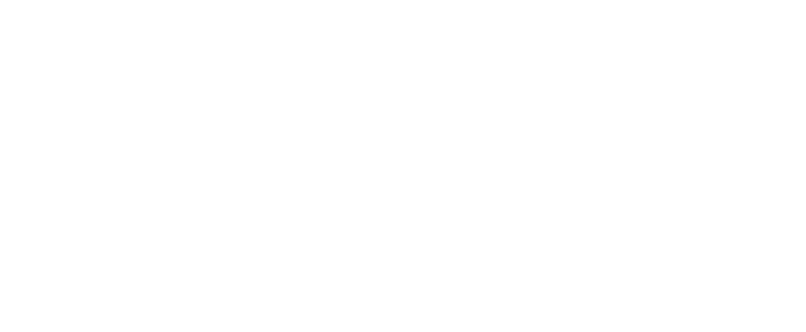

# 📡 ProcyonRadio

<p align="center">
  
</p>

<h3 align="center">ProcyonRadio</h3>

<p align="center">
  <strong>Servidor de streaming de audio y panel de control reactivo — autohospedado, multi-plataforma.</strong>
</p>

<p align="center">
  
  
  
  
</p>

---

## Descripcion

ProcyonRadio es un servidor de streaming autohospedado con panel web reactivo. Backend Node.js + Express + FFmpeg para transmision continua sin cortes (zero-gap).

---

## Stack Tecnologico

| Tecnologia | Version | Proposito |
|:-----------|:--------|:----------|
| **Node.js** | >=22 | Runtime |
| **Express** | ^4.21.2 | Servidor HTTP + API REST |
| **TypeScript** | ^5.8.3 | Lenguaje |
| **FFmpeg** | latest | Codificacion/decodificacion de audio (pipes) |
| **yt-dlp** | latest | Descarga de audio desde YouTube |
| **SQLite (WAL)** | built-in | Base de datos embebida |
| **Caddy** | latest | Proxy reverso + TLS automatico |
| **Cloudflared** | latest | Tunel HTTPS sin abrir puertos |
| **Docker** | compose | Despliegue en servidor |

## Caracteristicas Principales

### Streaming
- **Modo Icecast** (activo): Audio MP3/AAC a servidores de radio online (ZenoMedia, Icecast, Shoutcast)
- **Modo YouTube RTMP** (codigo presente, pendiente de reimplementacion en UI): Transmision a YouTube Live
- **Zero-gaps**: Codificador persistente, decodificadores PCM alternados en background

### Fuentes de Audio
- **YouTube**: Busqueda y descarga via yt-dlp (URLs, playlists, busqueda por nombre)
- **SoundCloud**: Fallback automatico si un tema falla en YouTube

### Control de Acceso (RBAC)
| Rol | Permisos |
|:----|:---------|
| **Owner / Admin** | Configuracion completa, gestion usuarios |
| **Operator** | Gestion de lista de reproduccion |
| **Guest** | Solo lectura del reproductor |

### Infraestructura
- **Tunel Cloudflare**: Subdominio HTTPS automatico sin abrir puertos
- **DDNS**: Actualizacion dinamica de DNS
- **Caddy**: Proxy reverso con TLS automatico
- **Docker**: Despliegue con docker-compose
- **Instalador Windows**: .exe portable con FFmpeg + yt-dlp incluidos

## Instalacion

### Docker (recomendado para servidor)
```bash
docker compose up --build -d livestream
```

### Windows (instalador portable)
Descargar ProcyonRadio-Instalador.exe desde Releases.

## Licencia

**Todos los derechos reservados.** Desarrollo privado.
