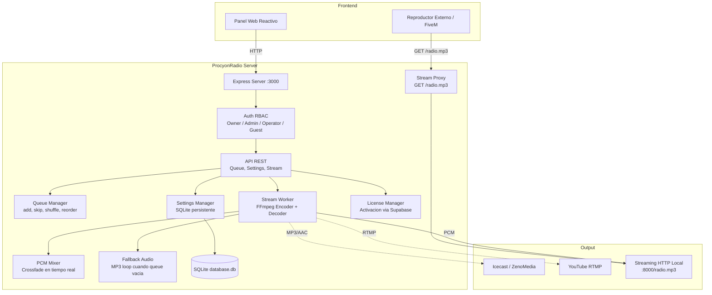
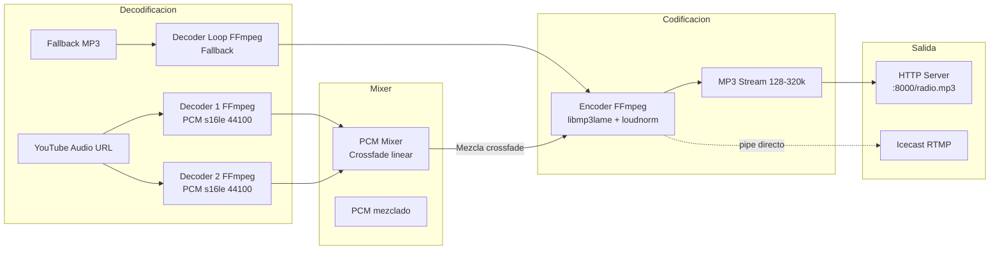

# 📡 ProcyonRadio

<p align="center">
  
</p>

<h3 align="center">Servidor de Streaming de Audio + Panel de Control — Autohospedado, Multi-Plataforma</h3>

<p align="center">
  <strong>Node.js</strong> ·
  <strong>Express</strong> ·
  <strong>TypeScript</strong> ·
  <strong>FFmpeg</strong> ·
  <strong>SQLite (WAL)</strong> ·
  <strong>yt-dlp</strong>
</p>

<p align="center">
  
  
  
</p>

---

## Descripcion

Servidor de streaming de audio autohospedado con panel web reactivo. Backend Node.js + Express + FFmpeg para transmision continua sin cortes (zero-gap) con crossfade en tiempo real, persistencia de configuracion en SQLite y despliegue portatil via pkg.

---

## Stack Tecnologico

| Tecnologia | Version package.json | Proposito |
|:-----------|:---------------------|:----------|
| **Node.js** | >=22.0.0 | Runtime |
| **Express** | ^4.21.2 | Servidor HTTP + API REST |
| **TypeScript** | ^5.8.3 | Lenguaje |
| **FFmpeg** | externo (bundled con pkg) | Codificacion/decodificacion de audio (pipes PCM) |
| **yt-dlp** | externo (bundled con pkg) | Descarga de audio desde YouTube |
| **SQLite (WAL)** | built-in | Base de datos embebida (settings, auth, queue) |
| **Caddy** | externo (descarga via prepare) | Proxy reverso + TLS automatico via DuckDNS |
| **Cloudflared** | externo | Tunel HTTPS sin abrir puertos |
| **CORS** | ^2.8.5 | Middleware CORS |
| **dotenv** | ^16.4.7 | Variables de entorno |
| **uuid** | ^11.1.0 | IDs unicos para cola |
| **pkg** | ^5.8.1 (dev) | Empaquetado Windows .exe |
| **tsx** | ^4.19.4 (dev) | Hot-reload en desarrollo |

## Arquitectura



## Caracteristicas Principales

### Streaming y Audio
- **Modo Icecast** (activo): Audio MP3/AAC a servidores de radio online (ZenoMedia, Icecast, Shoutcast)
- **Modo YouTube RTMP** (disponible en codigo, ⚠️ pendiente de exponer en UI): Transmision via RTMP a YouTube Live
- **Zero-gaps**: Codificador persistente FFmpeg, decodificadores PCM alternados en background
- **Crossfade en tiempo real**: Mezcla PCM con fade linear entre canciones (duracion configurable)
- **Fallback Audio**: Reproduce un MP3 local cuando la cola esta vacia o en pausa
- **Keep-Alive**: Generador de silencio periodico para evitar que el stream se corte por inactividad
- **Overlay Text**: Archivos `current_title.txt` y `current_artist.txt` para overlays en streaming
- **Stream Proxy**: Endpoint `/radio.mp3` para evitar bloqueos HTTPS Mixed Content en navegadores y FiveM

### Fuentes de Audio
- **YouTube**: Busqueda y descarga via yt-dlp (URLs, playlists, busqueda por nombre)
- **SoundCloud**: Fallback automatico si un tema falla en YouTube

### Cola de Reproduccion
- Agregar canciones por URL de YouTube
- Skip, pause, resume, seek, shuffle, clear
- Reordenar arrastrando (drag & drop via API)
- Reproducir cancion especifica por UUID
- Retroceder a cancion anterior (history pop)
- Notificaciones de fallos por cancion

### Control de Acceso (RBAC)
| Rol | Permisos |
|:----|:---------|
| **Owner** | Configuracion completa, gestion usuarios, stream lifecycle |
| **Admin** | Configuracion, gestion usuarios, stream lifecycle |
| **Operator** | Gestion de cola (add, skip, shuffle, reorder, seek) |
| **Guest** | Solo lectura del reproductor + agregar (si allowGuestAdd) |

### Infraestructura
- **Licencia por Activacion**: Sistema de licencias via Supabase (key validation)
- **Onboarding**: Setup wizard que guia al Owner inicial
- **SQLite persistente**: Settings migrados automaticamente desde legacy settings.json
- **Configuracion en caliente**: Cambiar settings actualiza encoder/tunnel/DDNS sin reiniciar
- **Caddy**: Proxy reverso con TLS automatico via DuckDNS (opcional)
- **DuckDNS**: Actualizacion dinamica de DNS (opcional)
- **Tunel Cloudflare**: Subdominio HTTPS automatico sin abrir puertos (opcional)
- **Instalador Windows**: .exe portable con FFmpeg + yt-dlp + Caddy incluidos (via pkg)

## API REST Completa

### Autenticacion
| Metodo | Ruta | Auth | Descripcion |
|:-------|:-----|:-----|:------------|
| POST | `/api/auth/setup` | — | Registrar Owner inicial (solo si no existe) |
| GET | `/api/auth/setup-status` | — | Verificar si setup esta completo |
| POST | `/api/auth/login` | — | Login, retorna token Bearer |
| POST | `/api/auth/logout` | ✅ | Invalidar sesion |
| GET | `/api/auth/me` | — | Obtener usuario actual |
| GET | `/api/auth/users` | Admin+ | Listar usuarios |
| POST | `/api/auth/users/create` | Admin+ | Crear usuario (username, password, role) |
| DELETE | `/api/auth/users/delete/:username` | Admin+ | Eliminar usuario |

### Cola (Queue)
| Metodo | Ruta | Auth | Descripcion |
|:-------|:-----|:-----|:------------|
| GET | `/api/queue` | — | Obtener cola actual |
| POST | `/api/queue/add` | Guest+ | Agregar cancion por URL de YouTube (allowGuestAdd) |
| POST | `/api/queue/skip` | Operator+ | Saltar a siguiente cancion con crossfade |
| POST | `/api/queue/back` | Operator+ | Retroceder a cancion anterior |
| POST | `/api/queue/seek` | Operator+ | Seek a timestamp (seconds) |
| POST | `/api/queue/play/:uuid` | Operator+ | Reproducir cancion especifica de la cola |
| POST | `/api/queue/pause` | Admin+ | Pausar transmision |
| POST | `/api/queue/resume` | Admin+ | Reanudar transmision |
| POST | `/api/queue/shuffle` | Operator+ | Mezclar cola aleatoriamente |
| POST | `/api/queue/clear` | Admin+ | Vaciar cola |
| POST | `/api/queue/reorder` | Operator+ | Reordenar (fromIndex, toIndex) |
| DELETE | `/api/queue/remove/:uuid` | Admin+ | Eliminar cancion especifica |

### Busqueda (Search)
| Metodo | Ruta | Auth | Descripcion |
|:-------|:-----|:-----|:------------|
| GET | `/api/search?q=...` | — | Buscar canciones en YouTube |

### Estado (Status)
| Metodo | Ruta | Auth | Descripcion |
|:-------|:-----|:-----|:------------|
| GET | `/health` | — | Health check + isFallback |
| GET | `/api/status` | — | Estado completo (track actual, cola, configuracion, fail notifications) |

### Settings
| Metodo | Ruta | Auth | Descripcion |
|:-------|:-----|:-----|:------------|
| GET | `/api/settings` | Admin+ | Obtener configuracion completa |
| POST | `/api/settings` | Admin+ | Actualizar configuracion (persiste en SQLite) |

### Stream
| Metodo | Ruta | Auth | Descripcion |
|:-------|:-----|:-----|:------------|
| GET | `/radio.mp3` | — | Proxy de stream local (bypass HTTPS Mixed Content) |
| GET | `/api/stream/proxy` | — | Alias de `/radio.mp3` |
| POST | `/api/stream/start` | Admin+ | Iniciar transmision |
| POST | `/api/stream/stop` | Admin+ | Detener transmision |

### Onboarding
| Metodo | Ruta | Auth | Descripcion |
|:-------|:-----|:-----|:------------|
| POST | `/api/onboarding/test-stream` | — | Probar conectividad (Icecast, RTMP, YouTube) |

## Estructura del Proyecto

```
backend/
├── src/
│   ├── index.ts                    # Entrypoint: Express + middlewares + todas las rutas
│   ├── settings/
│   │   └── settings.manager.ts     # Gestion de configuracion persistente en SQLite
│   ├── stream/
│   │   ├── stream.worker.ts        # StreamWorker: FFmpeg encoder, decoder, PCM mixer, crossfade, keep-alive
│   │   └── stream.server.ts        # Servidor HTTP local para broadcasting MP3
│   ├── queue/
│   │   └── queue.manager.ts        # QueueManager: cola FIFO, shuffle, reorder, history, notificaciones
│   ├── database/
│   │   └── database.service.ts     # Servicio de SQLite (WAL mode) con autovacuum
│   ├── auth/
│   │   └── auth.manager.ts         # AuthManager: RBAC, sesiones Bearer token, registro de usuarios
│   ├── db/
│   │   └── db-init.ts              # Inicializacion de tablas SQLite
│   └── utils/
│       ├── youtube.ts              # SearchTracks, extractYoutubeIds, getTrackMetadata
│       ├── tunnel.manager.ts       # Cloudflare tunnel manager
│       ├── caddy.manager.ts        # Caddy reverse proxy + TLS manager
│       ├── ddns.manager.ts         # DuckDNS dynamic DNS updater
│       └── license.ts              # License activation via Supabase API
├── public/                         # Frontend estatico (HTML/JS/CSS)
├── package.json                    # v1.0.0
└── tsconfig.json
```

## Configuracion Persistente (SQLite)

Settings almacenados en tabla `system_settings` con migracion automatica desde legacy `settings.json`:

| Key | Tipo | Default | Descripcion |
|:----|:-----|:--------|:------------|
| port | number | 3000 | Puerto del servidor Express |
| outputMode | string | "youtube" | `youtube` o `icecast` |
| allowGuestAdd | boolean | true | Permitir a invitados agregar canciones |
| exposeServer | boolean | false | Exponer via Cloudflare tunnel |
| youtube.rtmpUrl | string | rtmp://a.rtmp.youtube.com/live2 | URL RTMP |
| youtube.streamKey | string | "" | Key de stream YouTube |
| icecast.serverUrl | string | "" | URL servidor Icecast |
| icecast.format | string | "mp3" | `mp3` o `aac` |
| icecast.bitrate | string | "128k" | Bitrate Icecast |
| fadeDuration | number | 3 | Duracion del crossfade (segundos) |
| fallbackVolume | number | 5 | Volumen del fallback (%) |
| streamPort | number | 8000 | Puerto del stream local |
| streamServerEnabled | boolean | true | Activar servidor de stream HTTP local |
| duckdnsEnabled | boolean | false | Activar DuckDNS |
| duckdnsDomain | string | "" | Dominio DuckDNS |
| duckdnsToken | string | "" | Token DuckDNS |
| stationAlias | string | "ProcyonRadio" | Nombre de la radio |
| stationLanguage | string | "es" | Idioma (`es` o `en`) |
| ownerEmail | string | "" | Email del Owner (para Caddy TLS) |

## Streaming Interno



## Instalacion

### Desarrollo
```bash
cd backend
npm install
npm run dev           # tsx watch src/index.ts (puerto 3000)
```

### Windows (instalador portable)
```bash
npm run package:win   # Genera dist/package/ProcyonRadio.exe
```
Descargar ProcyonRadio-Instalador.exe desde Releases para version pre-empaquetada.

### Produccion
```bash
cd backend
npm run build         # Compilacion TypeScript
npm start             # node dist/index.js
```

### Requisitos Externos
- FFmpeg en PATH (o ffmpeg.exe en la raiz del proyecto)
- yt-dlp en PATH (o yt-dlp.exe en la raiz del proyecto)
- Caddy: Se descarga automaticamente via `npm run prepare`

## Variables de Entorno

```env
PORT=3000                            # Puerto del servidor
OUTPUT_MODE=youtube                  # youtube | icecast
EXPOSE_SERVER=false                  # Exponer via tunnel
YOUTUBE_RTMP_URL=rtmp://a.rtmp.youtube.com/live2
YOUTUBE_STREAM_KEY=                  # Tu stream key de YouTube
ICECAST_SERVER_URL=                  # URL del servidor Icecast
ICECAST_FORMAT=mp3                   # mp3 | aac
ICECAST_BITRATE=128k                 # Bitrate Icecast
FADE_DURATION=3                      # Crossfade en segundos
STREAM_PORT=8000                     # Puerto del stream local
STREAM_SERVER_ENABLED=true           # Activar stream HTTP local
DUCKDNS_ENABLED=false                # Activar DuckDNS
DUCKDNS_DOMAIN=                      # Tu dominio DuckDNS
DUCKDNS_TOKEN=                       # Tu token DuckDNS
STATION_ALIAS=ProcyonRadio           # Nombre de la radio
STATION_LANGUAGE=es                  # es | en
```

## Notas

- **Modo YouTube RTMP**: Implementado en `settings.manager.ts` y `stream.worker.ts` pero aun **no expuesto en la UI**. Se activa via API de settings.
- **Cache de YouTube**: Las busquedas se hacen en tiempo real via yt-dlp, sin cache local.
- **Overlay de texto**: El StreamWorker escribe `data/current_title.txt` y `data/current_artist.txt` para overlays OBS/XSplit.
- **Licencia**: Requiere activacion via clave. Sin licencia, la app redirige a `/activate`.
- **Backwards compatibility**: Migra automaticamente settings desde `settings.json` legacy a SQLite.

## Licencia

**Todos los derechos reservados.** Desarrollo privado — Ecosistema Procyon.
